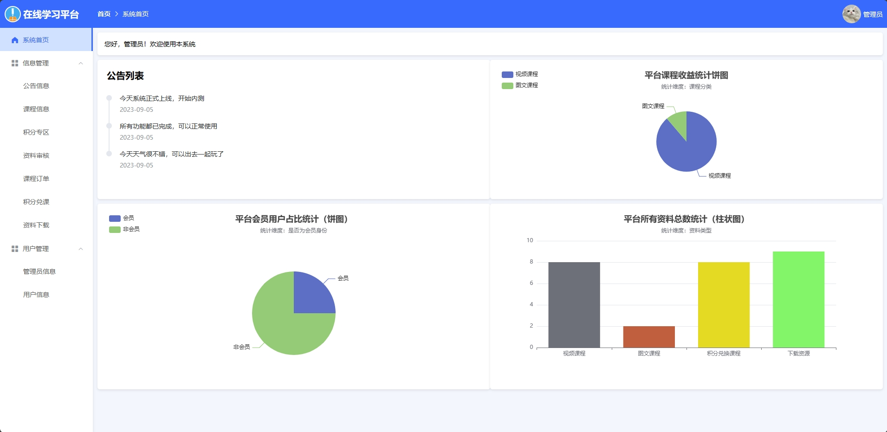
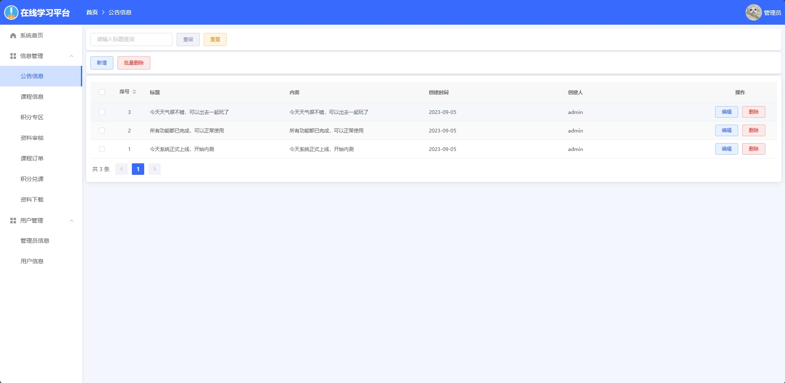
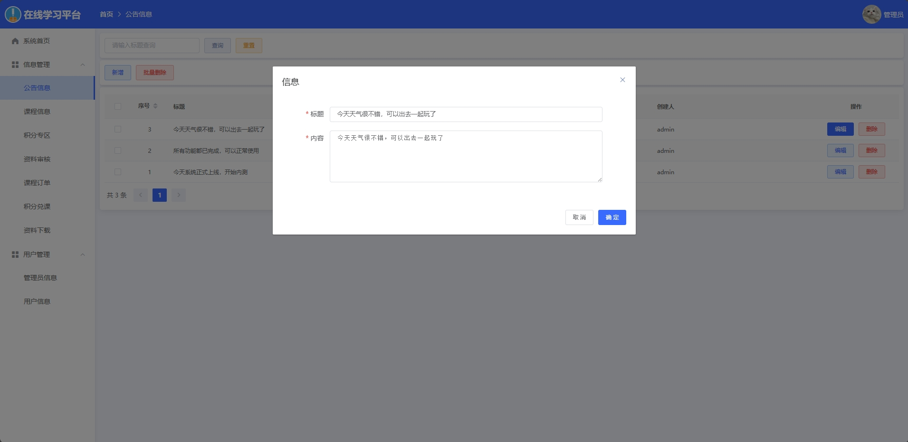
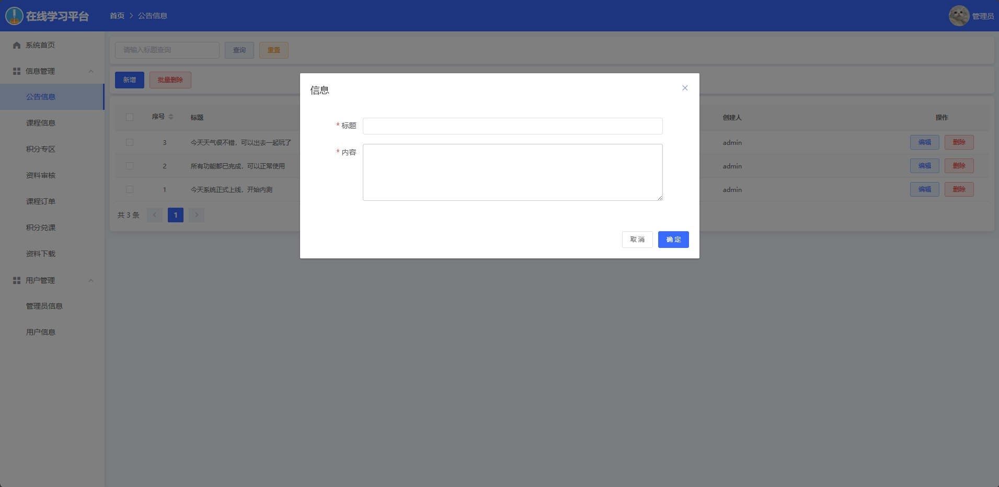
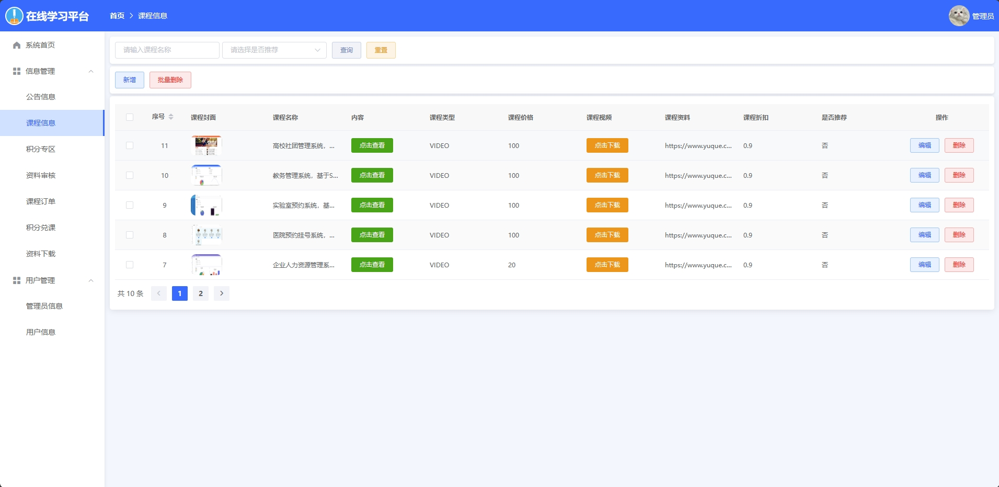

<h1 align="center">基于SSM的在线学习系统</h1>

<h4> 完整代码获取地址：从戎源码网（https://armycodes.com/） </h4>
<h4> 作者微信：19941326836 QQ：605739993 QQ群：655392706 </h4>
<h4> 承接计算机毕设、Java毕业设计、Python毕业设计、深度学习、机器学习 </h4>
<h4> 选题+开题报告+任务书+程序定制+安装调试+论文+答辩ppt 一条龙服务 </h4>
<h4> 毕业设计所有选题地址：(https://github.com/Descartes007/allProject) </h4>

## 一、项目介绍

基于SSM的在线学习系统：前端 Vue、ElementUI，后端 SpringBoot、Mybatis，系统角色分为：管理员和用户，管理员在管理后台管理用户信息，对资源信息进行录入，新增课程，对订单进行管理，添加新管理员等；用户根据发布的课程进行选购，可以对账户充钱，购买和解锁课程，并且查看自己的订单列表等。主要功能如下：

### 1、管理员：

- 基本操作：登录、修改个人信息、上传图片、获取个人信息、获取公告列表、平台收益统计、平台用户统计
- 公告管理：获取公告列表、筛选公告信息、修改公告信息、删除公告信息、新增公告
- 课程管理：获取课程列表、筛选课程信息、查看课程详情、修改课程信息、删除课程信息、新增课程、下载课程视频、审核、资料下载
- 积分管理：获取积分列表、筛选积分信息、查看积分详情、修改积分信息、删除积分信息、新增积分、积分兑课
- 订单管理：获取订单列表、筛选订单信息
- 管理员管理：获取管理员列表、筛选管理员信息、查看管理员详情、修改管理员信息、删除管理员信息、添加管理员
- 用户管理：获取用户列表、筛选用户信息、查看用户详情、修改用户信息、删除用户信息、添加用户

### 2、用户：

- 基本操作：登录、修改个人信息、上传图片、获取个人信息、注册用户、余额充值、获取轮播图列表、签到
- 在线课程：获取课程列表、查看课程详情、兑换课程资料、历史兑换
- 在线资源：获取资源列表、查看资源详情、兑换资源、历史兑换、下载课程资料
- 积分专区：获取积分兑换列表、兑换课程、筛选积分兑换课程
- 我的资料：获取我的资料列表、筛选资料、发布资料、删除资料、编辑资料
- 我的已购：获取已购列表、获取我的兑换列表
- 个人中心：修改密码、充值余额

## 二、环境

- <b>IntelliJ IDEA 2020.3</b>

- <b>Mysql 5.7.26</b>

- <b>NodeJs 14.17.3</b>

- <b>Maven 3.6.3</b>

- <b>JDK 1.8</b>

## 三、运行截图

